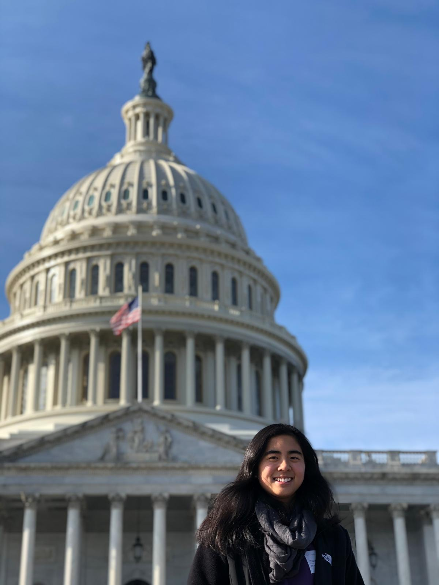

::: columns
::: {.column width="60%"}
**Welcome!**

I am a Ph.D. student in the Department of Political Science at the University of California, San Diego. My research interests include Congress, diplomacy, U.S. foreign policy, and U.S.-China relations.

I received a B.A. in Government & Politics and a B.S. in Information Systems from the University of Maryland, College Park in 2021. My research and graduate studies are funded by the NSF Graduate Research Fellowship Program and the 21st Century China Center at UCSD.

#### [CV](RYu-CVpdf)
:::

::: {.column width="10%"}
#### 
:::
:::

{width="579"}
